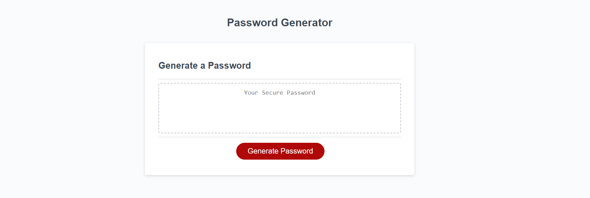
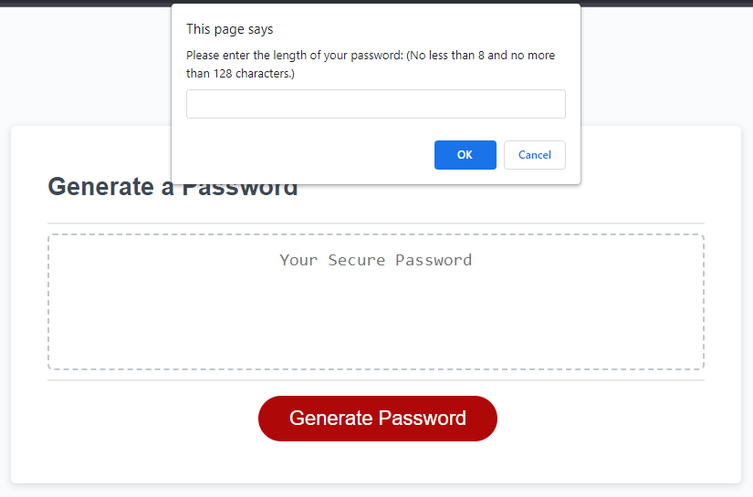

# Password Generator

## Description

The website was made to allow users to have the program generate a random password based on their own perferences. Through series of prompts, the user is able to choose what they want as long as it fits with the program's criteria. Through this website, users can easily have their very own unique password they can use anywhere. While making the generator, I learned how functions can work, window prompts, and if statements. I also learned the purpose for math random to help randomly choose items to link together.

## Table of Contents (Optional)

- [Installation](#installation)
- [Usage](#usage)
- [Credits](#credits)
- [License](#license)

## Installation

N/A

## Usage

Website:


When the user enters the browser, they will see a red button titled "Generate". Once clicked, a popup will display at the top asking the user how long they want their password to be. The prompt will have criteria it must meet and if the user does not follow them, the prompt will alert them the error until they meet the criteria. Once the user has selected what they want for their password, the generator will validate them and generte the password into the text box for the user to use.

    ```md
    
    ```

## Credits

N/A

## Codes Used

The code for the challenge can be found in the following file:

- [script.js](/src/script.js): Contains the Javascript code of the landing page.

- [script.js](/src/script.js) LINE 15 - 18: Based on the work of [Refsnes Data](https://www.w3schools.com/jsref/jsref_parseint.asp)

```
    if ( parseInt(length)) {

            // holds the conversion in a variable
            var lengthInt = parseInt(length);
```

- [script.js](/src/script.js) LINE 49 - 52: Based on the work of [Refsnes Data](https://www.w3schools.com/jsref/jsref_split.asp)

```
    var lowerAlp = "abcdefghijklmnopqrstuvwxyz".split( '' );
    var upperAlp = "ABCDEFGHIJKLMNOPQRSTUVWXYZ".split( '' );
    var num = "0123456789".split( '' );
    var spcha = "!@#$%^&*()".split( '' );
```

- [script.js](/src/script.js) LINE 55 - 65: Based on the work of [Refsnes Data](https://www.w3schools.com/jsref/jsref_concat_array.asp)

```
    if (inputLower && inputUpper && inputNum && inputSpC) {
        input = lowerAlp.concat(upperAlp, num, spcha);
    }
    if (inputLower && !inputUpper && !inputNum && !inputSpC) {
        input = lowerAlp;
    }
    if (inputLower && inputUpper && !inputNum && !inputSpC) {
        input = lowerAlp.concat(upperAlp);
    }
    else if (inputLower && inputUpper && inputNum && !inputSpC) {
        input = lowerAlp.concat(upperAlp, num);
```

- [script.js](/src/script.js) LINE 74: Based on the work of [Refsnes Data](https://www.w3schools.com/jsref/jsref_push.asp)

```
    password.push(randomNumber);
```

## License

N/A

## Badges

N/A

## Features

N/A

## How to Contribute

N/A

## Tests

N/A